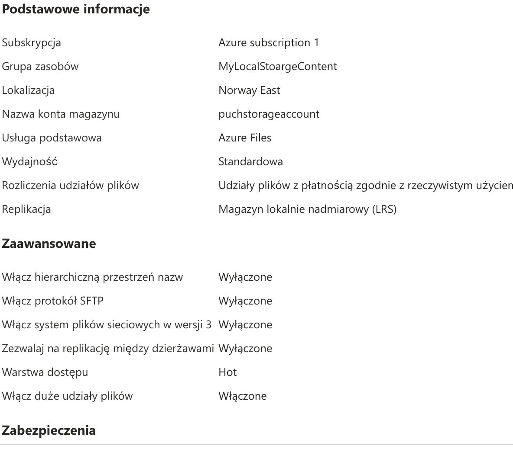

Ćwiczenie: Baza danych MS SQL Server w Azure
link - https://github.com/Kostelke/Puch_sprawozdania/blob/main/Lab_1/lab_1_sprawozdanie.md

Krok 1: Utworzenie konta w Azure
Rejestracja na stronie Azure przebiegła bez przeszkód
Krok 2: Utworzenie instancji Azure SQL Database
Baza została stowrzona korzystając z domyślnych ustawień

c. Wybór źródła danych
Jako źródło danych wybrałem microsoftową bazę adventure Works
d. Konfiguracja serwera
Stworzyłem nowy serwer Puch-server
e. Wybór opcji cenowych i rozmiaru
Wybrałem opcję domyślne ( najtańsze/ zawierajace sie w darmowym pakiecie)
f. Dodatkowe ustawienia
Ustawienia te były włączone domyślnie

Krok 3: Zatwierdzenie i wdrożenie

Krok 4: Połączenie z bazą danych
Poniewa pracuje na MAC-OS musiałem uzyc w tym celu DBeavera

Krok 5: Tworzenie aplikacji
Po zainstalowaniu pakietów napisałem prosty kod pobierajacy

Krok 6: Konfiguracja maszyny wirtualnej
Niestey w tym korku napotkalem problem - pomimo stworzenia maszyny wirutalnej, nie mogłem sie potem z nią połączyc
przez remote desktop, nie działała take konsola - ustawiłem porty itp, w remoteDesktop widziałem po prostu czarny ekran

Krok 7: Praca z Azure Table Storage
Stowrzyłem odpowiedni zasób

po zainstalowaniu odpowiednich pakietów napisałem prosty kod realizujacy funkcjonalność CRUD

1. Konfiguracja Firewalla Azure SQL Database
   Juz przy początku tworzenia SQL Dtabase ustawiłem te wartości tak by akcpetowały tylko moje IP.
   Azure Cosmos DB
   Stowrzyłem Azure DB z SQL Api
   

Nastepnie stworzyłem baze danych i kontener

Oraz dodałem testowo jeden plik JSON

Integracja z aplikacją:

Napisałem prostą aplikację (CosmosCbService i program ) do realizacji obłsugi CRUD

